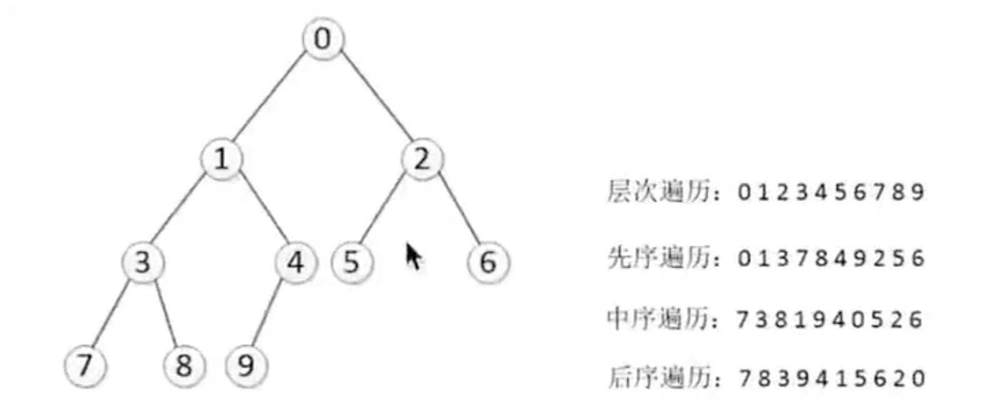

## 栈

```angularjs
class Stack():
    def __init__(self):
        self.stack = []

    def push(self,element):
        """进栈"""
        self.stack.append(element)

    def pop(self):
        """出栈"""
        if len(self.stack) == 0:
            return None
        return self.stack.pop()

    def get_top(self):
        """取栈顶"""
        if len(self.stack) == 0:
            return None
        return self.stack[-1]


if __name__ == '__main__':
    stack = Stack()
    stack.push(1)
    stack.push(2)
    stack.push(3)
    print(stack.pop())

```
### 栈的应用-括号匹配

```angularjs
class Stack():
    def __init__(self):
        self.stack = []

    def push(self,element):
        """进栈"""
        self.stack.append(element)

    def pop(self):
        """出栈"""
        if len(self.stack) == 0:
            return None
        return self.stack.pop()

    def get_top(self):
        """取栈顶"""
        if len(self.stack) == 0:
            return None
        return self.stack[-1]

    def is_empty(self):
        return len(self.stack) == 0

def brace_match(str):
    match = {"}":"{","]":"[",")":"("}
    stack = Stack()
    for char in str:
        if char in {"{","[","("}:
            stack.push(char)
        else:    #char in {"}","]",")"}
            if stack.is_empty():
                return False
            elif stack.get_top() == match[char]:
                stack.pop()
            else:   # stack.get_top() != match[char]
                return False
    if stack.is_empty():
        return True
    else:
        return False


if __name__ == '__main__':
    print(brace_match("[{}(}]"))
```
## 队列


## 队列的实现

-------------------------------------


```python
class Queue:
    def __init__(self,size=100):
        self.queue = [0 for _ in range(size)]
        self.size = size
        self.rear = 0      # 队尾 进队
        self.front = 0     # 队首 出队

    def push(self,element):
        """增加"""
        if not self.is_fulled():
            self.rear = (self.rear + 1) % self.size
            self.queue[self.rear] = element
        else:
            raise IndexError("Queue is full")

    def pop(self):
        """删除"""
        if not self.is_empty():
            self.front = (self.front + 1) % self.size
            return self.queue[self.front]
        else:
            return None

    def is_empty(self):
        """判断队列是否为空 图1"""
        return self.rear == self.front

    def is_fulled(self):
        """判断队列是否为满"""
        return (self.rear + 1) % self.size == self.front


if __name__ == '__main__':
    q = Queue(5)
    for i in range(4):
        q.push(i)
    print(q.is_fulled())    # 查看队列是否满
    print(q.pop())
    print(q.pop())
    print(q.queue[(q.front + 1):])
```


## 二叉树 增加 遍历

-------------------------------------


```python

class Node(object):
    """节点"""
    def __init__(self,item):
        self.elem = item
        self.lchild = None
        self.rchild = None


class Tree(object):
    """二叉树, 完全二叉树"""
    def __init__(self):
        self.root = None

    def add(self,item):
        node = Node(item)
        if self.root is None:
            self.root = node
            return
        queue = [self.root]
        while queue:
            cur_node = queue.pop(0)
            if cur_node.lchild is None:
                cur_node.lchild = node
                return
            else:
                queue.append(cur_node.lchild)

            if cur_node.rchild is None:
                cur_node.rchild = node
                return
            else:
                queue.append(cur_node.rchild)


    def breadth_travel(self):
        """广度遍历"""
        if self.root is None:
            return
        queue = [self.root]
        while queue:
            cur_node = queue.pop(0)
            print(cur_node.elem)
            if cur_node.lchild is not None:
                queue.append(cur_node.lchild)
            if cur_node.rchild is not None:
                queue.append(cur_node.rchild)

    def pretorder(self,node):
        """前序遍历"""
        if node is None:
            return
        print(node.elem, end=" ")
        self.pretorder(node.lchild)
        self.pretorder(node.rchild)


    def inorder(self,node):
        """中序遍历"""
        if node is None:
            return
        self.inorder(node.lchild)
        print(node.elem,end=" ")
        self.inorder(node.rchild)

    def postorder(self,node):
        """后续遍历"""
        if node is None:
            return
        self.postorder(node.lchild)
        self.postorder(node.rchild)
        print(node.elem, end=" ")

if __name__ == '__main__':
    tree = Tree()
    tree.add(0)
    tree.add(1)
    tree.add(2)
    tree.add(3)
    tree.add(4)
    tree.add(5)
    tree.add(6)
    tree.add(7)
    tree.add(8)
    tree.add(9)
    tree.breadth_travel()       #广度遍历

    print("\n")
    tree.pretorder(tree.root)
    print("\n")
    tree.inorder(tree.root)
    print("\n")
    tree.postorder(tree.root)
    
-----------------
0
1
2
3
4
5
6
7
8
9


0 1 3 7 8 4 9 2 5 6 

7 3 8 1 9 4 0 5 2 6 

7 8 3 9 4 1 5 6 2 0 

```
## 二叉搜索树


