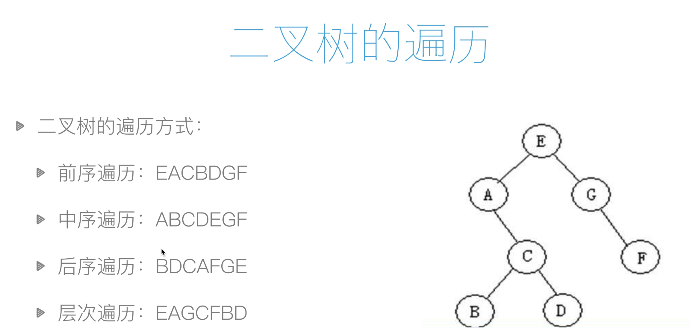

## 可变数据类型和不可变数据类型

https://blog.csdn.net/xiaosongshupy/article/details/79460246
https://www.cnblogs.com/lfpython/p/7207747.html
可变数据类型

    * 列表 (list)
    * 字典 (dict)
    
不可变数据类型

    - 整型（int）
    - 浮点型（float）
    - 字符串型（String）
    - 元组型（tuple）

## 赋值、浅拷贝和深拷贝的区别

a = [1,2,"hello",['python', 'C++']]

b = a       
a 和 b 是一样的，他们指向同一片内存，b 不过是 a 的别名，是引用。
我们可以使用 b is a 去判断，返回 True，表明他们地址相同，内容相同，也可以使用 id()函数来查 看两个列表的地址是否相同。
赋值操作(包括对象作为参数、返回值)不会开辟新的内存空间，它只是复制了对象的引用。也就是 说除了 b 这个名字之外，没有其他的内存开销。修改了 a，也就影响了 b，同理，修改了 b，也就影响 了 a。

## 列表反转
```python
li = [1,2,4,5]

for i in range(int(len(li) / 2)):
    temp = li[len(li) - i - 1]
    li[len(li) - i - 1] = li[i]
    li[i] = temp

print(li)

------------
[5, 4, 2, 1]

```
## 斐波那契数列
```angularjs
def func(n):
    a, b = 0, 1
    while b <= n:
        print(b, end=" ")
        a, b = b, a+b

func(10)

------------
1 1 2 3 5 8 
```
## 猴子跳10节台阶
```python
def func(n):
    if n == 1:
        return 1
    elif n == 2:
        return 2
    else:
        return func(n-1) + func(n-2)

obj = func(10)
print(obj)

-----------
89
```

## 二叉树前中后序


[代码链接](http://www.golangav.com:8000/basic/algoriathm/#_1 )


